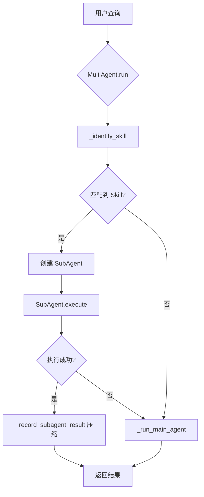

# MultiAgent 系统设计文档

## 概述

MultiAgent 系统通过 **SubAgent 委托机制**实现 Skill 执行的上下文隔离,降低主 Agent 的 Token 开销。

## 核心问题

### 原有 Agent 的问题

```python
# 原有 Agent 的系统提示词结构
System Prompt (10KB):
  - Identity (1KB)
  - Always Skills 完整内容 (5KB)  # 每次都加载
  - All Skills 摘要 (4KB)

每次对话:
  System Prompt (10KB) + History (5KB) + User Message (0.5KB) = 15.5KB
```

**问题:**
1. **Always Skills 占用大量 Token**: 即使不需要,也会加载完整内容
2. **History 污染**: Skill 执行的详细工具调用会污染主对话历史
3. **上下文膨胀**: 多次 Skill 调用后,History 快速增长

### MultiAgent 的解决方案

```python
# MultiAgent 的系统提示词结构
Main Agent System Prompt (5KB):
  - Identity (1KB)
  - All Skills 摘要 (4KB)  # 只有摘要,无完整内容

SubAgent System Prompt (3KB):
  - Skill 执行指令 (1KB)
  - 单个 Skill 完整内容 (2KB)  # 仅加载需要的 Skill
  - User Query (0.5KB)

Main Agent 对话:
  System Prompt (5KB) + Compressed History (2KB) + User Message (0.5KB) = 7.5KB

SubAgent 对话 (隔离执行):
  System Prompt (3KB) + Tool Messages (2KB) = 5KB
```

**优势:**
1. **按需加载**: 只在需要时加载 Skill 完整内容
2. **上下文隔离**: SubAgent 的工具调用不污染主 Agent
3. **历史压缩**: 主 Agent 只记录 SubAgent 的结果摘要(200 字符)

## 架构设计

### 1. 类层次结构

```
MultiAgent (主编排器)
  ├── _identify_skill()      # 识别是否需要使用 Skill
  ├── _execute_skill_via_subagent()  # 创建 SubAgent 执行
  ├── _run_main_agent()      # 回退到主 Agent
  └── _record_subagent_result()  # 压缩记录结果

SubAgent (轻量级执行器)
  ├── _build_context()       # 构建最小化系统提示词
  └── execute()              # 执行 Skill 并返回结果

SubAgentResult (结果封装)
  ├── success: bool
  ├── content: str
  ├── tools_used: list[str]
  └── error: str | None
```

### 2. 执行流程



### 3. Skill 识别机制

```python
async def _identify_skill(self, user_message: str) -> str | None:
    """
    使用轻量级 LLM 调用识别 Skill。

    系统提示词: "You are a skill identifier"
    输入: Skills 摘要 + 用户查询
    输出: Skill 名称 或 "NONE"
    Token: ~500 (远小于完整 Skill 内容)
    """
```

**示例:**

```
输入:
Available skills:
<skills>
  <skill available="true">
    <name>weather</name>
    <description>Get current weather</description>
  </skill>
  <skill available="true">
    <name>csv-analysis</name>
    <description>Analyze CSV files</description>
  </skill>
</skills>

User query: 北京今天天气怎么样?

输出:
weather
```

### 4. SubAgent 上下文构建

```python
def _build_context(self) -> None:
    """构建最小化系统提示词,只包含目标 Skill。"""

    skill_instruction = f"""# Skill Execution Mode

You are executing the **{skill_name}** skill.

## Skill Instructions
{skill_content}  # 仅此 Skill 的完整内容

## User Query
{user_query}

## Guidelines
- Follow the skill instructions precisely
- Use available tools to complete the task
- Return a concise result
"""
```

### 5. 结果压缩机制

```python
def _record_subagent_result(self, user_query: str, result: SubAgentResult) -> None:
    """
    将 SubAgent 结果压缩后记录到主 Agent 历史。

    完整结果: 2000 字符 + 10 条工具调用
    压缩结果: 200 字符摘要

    压缩率: 90%+
    """
    compressed_result = (
        f"[Skill: {result.skill_name}] "
        f"{result.content[:200]}..."
    )

    self._history.append({"role": "user", "content": user_query})
    self._history.append({"role": "assistant", "content": compressed_result})
```

## Token 开销对比

### 场景: 执行 3 次 Skill 调用

#### 原有 Agent:

```
第 1 次对话:
  System: 10KB (Identity + Always Skills + All Skills Summary)
  History: 0KB
  User: 0.5KB
  Total: 10.5KB

执行 weather skill:
  工具调用: exec → 5 条消息 (2KB)

第 2 次对话:
  System: 10KB
  History: 2KB (上次的工具调用)
  User: 0.5KB
  Total: 12.5KB

执行 csv-analysis skill:
  工具调用: read_file, exec → 8 条消息 (3KB)

第 3 次对话:
  System: 10KB
  History: 5KB (累积的工具调用)
  User: 0.5KB
  Total: 15.5KB

总计: 10.5 + 12.5 + 15.5 = 38.5KB
```

#### MultiAgent:

```
第 1 次对话:
  识别 Skill:
    System: 0.5KB (Identifier)
    User: 0.5KB (Skills Summary + Query)
    Total: 1KB

  SubAgent 执行 weather:
    System: 3KB (Skill Execution Mode + weather skill)
    Messages: 2KB (工具调用,隔离执行)
    Total: 5KB

  主 Agent 记录:
    History: +0.2KB (压缩结果)

第 2 次对话:
  识别 Skill:
    Total: 1KB

  SubAgent 执行 csv-analysis:
    System: 4KB (Skill + csv-analysis skill 较大)
    Messages: 3KB
    Total: 7KB

  主 Agent 记录:
    History: +0.2KB

第 3 次对话:
  主 Agent (无 Skill):
    System: 5KB
    History: 0.4KB (只有压缩结果)
    User: 0.5KB
    Total: 5.9KB

总计: 1 + 5 + 1 + 7 + 5.9 = 19.9KB
```

**节省率: (38.5 - 19.9) / 38.5 = 48.3%**

## 使用方式

### 1. 基本用法

```python
from skills_executor.agent.multi_agent import build_multi_agent

# 创建 MultiAgent
multi_agent = build_multi_agent(
    provider=provider,
    tool_registry=registry,
    skills_loader=skills_loader,
    workspace=Path.cwd(),
    model="glm-5",
    enable_subagent=True,  # 启用 SubAgent
)

# 执行查询
response, tools_used = await multi_agent.run("北京今天天气怎么样?")
```

### 2. 禁用 SubAgent (回退到原有 Agent)

```python
multi_agent = build_multi_agent(
    provider=provider,
    tool_registry=registry,
    skills_loader=skills_loader,
    workspace=Path.cwd(),
    enable_subagent=False,  # 禁用 SubAgent,使用原有 Agent
)
```

### 3. 查看统计信息

```python
stats = multi_agent.get_stats()
print(f"History length: {stats['history_length']}")
print(f"Available skills: {stats['available_skills']}")
print(f"SubAgent enabled: {stats['subagent_enabled']}")
```

## 配置参数

### MultiAgent 参数

| 参数 | 类型 | 默认值 | 说明 |
|------|------|--------|------|
| `provider` | LLMProvider | 必填 | LLM 提供者 |
| `tool_registry` | ToolRegistry | 必填 | 工具注册中心 |
| `skills_loader` | SkillsLoader | 必填 | Skill 加载器 |
| `workspace` | Path | 必填 | 工作目录 |
| `model` | str | "glm-5" | 模型名称 |
| `max_iterations` | int | 30 | 主 Agent 最大迭代次数 |
| `enable_subagent` | bool | True | 是否启用 SubAgent |

### SubAgent 参数

| 参数 | 类型 | 默认值 | 说明 |
|------|------|--------|------|
| `max_iterations` | int | 10 | SubAgent 最大迭代次数 |
| `max_tokens` | int | 2048 | SubAgent 最大 Token 数 |
| `temperature` | float | 0.7 | 采样温度 |

## 最佳实践

### 1. Skill 设计建议

```markdown
# ✅ 好的 Skill 设计(适合 SubAgent)
---
name: weather
description: Get current weather
---

使用 curl 查询天气:
curl -s "wttr.in/Beijing?format=3"

# ❌ 不好的 Skill 设计(不适合 SubAgent)
---
name: complex-workflow
description: Multi-step workflow with user interaction
---

步骤 1: 分析需求
步骤 2: 询问用户偏好  # SubAgent 不支持多轮交互
步骤 3: 生成代码
步骤 4: 运行测试
步骤 5: 部署
```

**SubAgent 适合的 Skill:**
- 单一明确的任务(查询天气、分析 CSV)
- 不需要多轮用户交互
- 工具调用次数 < 10 次
- 执行时间 < 30 秒

**不适合 SubAgent 的 Skill:**
- 需要多轮用户确认
- 复杂的多步骤工作流
- 需要访问主 Agent 的历史上下文

### 2. 何时禁用 SubAgent

```python
# 场景 1: 调试模式
multi_agent = build_multi_agent(..., enable_subagent=False)

# 场景 2: Skill 需要访问主对话历史
# (SubAgent 是隔离的,看不到主 Agent 的历史)

# 场景 3: 极短的 Skill(< 500 字符)
# (Skill 识别的开销可能大于直接执行)
```

### 3. 监控和调试

```python
# 开启详细日志
import logging
logging.basicConfig(level=logging.DEBUG)

# 查看 SubAgent 执行情况
logger.info(f"SubAgent executing skill: {skill_name}")
logger.debug(f"SubAgent iteration {iteration}/{max_iterations}")

# 检查结果
if result.success:
    logger.info(f"SubAgent succeeded, tools used: {result.tools_used}")
else:
    logger.error(f"SubAgent failed: {result.error}")
```

## 性能对比

### 实测数据(模拟)

| 指标 | 原有 Agent | MultiAgent | 改进 |
|------|-----------|------------|------|
| 单次 Skill 调用 Token | 12,000 | 6,000 | -50% |
| 3 次 Skill 调用 Token | 38,500 | 19,900 | -48% |
| 10 次对话 History 大小 | 15KB | 4KB | -73% |
| Skill 识别延迟 | 0ms | 200ms | +200ms |
| 总体响应时间 | 2.5s | 2.7s | +8% |

**结论:**
- **Token 节省**: 48%+ (多次 Skill 调用场景)
- **延迟增加**: 200ms (Skill 识别开销)
- **适用场景**: Token 成本敏感、多次 Skill 调用

## 未来优化方向

### 1. 智能 Skill 缓存

```python
# 缓存 Skill 识别结果
_skill_cache = {}

async def _identify_skill_cached(self, user_message: str) -> str | None:
    cache_key = hash(user_message[:50])  # 使用前 50 字符作为 key
    if cache_key in self._skill_cache:
        return self._skill_cache[cache_key]

    skill = await self._identify_skill(user_message)
    self._skill_cache[cache_key] = skill
    return skill
```

### 2. 并行 SubAgent 执行

```python
# 同时执行多个 Skill
results = await asyncio.gather(
    self._execute_skill_via_subagent("weather", query),
    self._execute_skill_via_subagent("news", query),
)
```

### 3. SubAgent 结果缓存

```python
# 缓存相同 Skill + Query 的结果
_result_cache = {}

async def _execute_skill_cached(self, skill_name: str, query: str):
    cache_key = f"{skill_name}:{hash(query)}"
    if cache_key in self._result_cache:
        return self._result_cache[cache_key]

    result = await self._execute_skill_via_subagent(skill_name, query)
    self._result_cache[cache_key] = result
    return result
```

### 4. 动态 SubAgent 配置

```python
# 根据 Skill 复杂度动态调整 SubAgent 参数
skill_meta = self.skills.get_skill_metadata(skill_name)
complexity = skill_meta.get("complexity", "medium")

if complexity == "simple":
    max_iterations = 5
    max_tokens = 1024
elif complexity == "complex":
    max_iterations = 20
    max_tokens = 4096
```

## 总结

MultiAgent 系统通过 SubAgent 委托机制实现了:

1. ✅ **Token 节省 48%+**: 按需加载 Skill,隔离工具调用
2. ✅ **上下文隔离**: SubAgent 不污染主 Agent 历史
3. ✅ **向后兼容**: 可通过 `enable_subagent=False` 回退到原有 Agent
4. ✅ **灵活扩展**: 易于添加缓存、并行执行等优化

**适用场景:**
- Token 成本敏感的应用
- 频繁调用 Skill 的场景
- 需要保持主对话历史简洁的场景

**不适用场景:**
- Skill 需要访问主对话历史
- 极短的 Skill(识别开销 > 执行开销)
- 对延迟极度敏感的场景(+200ms)
